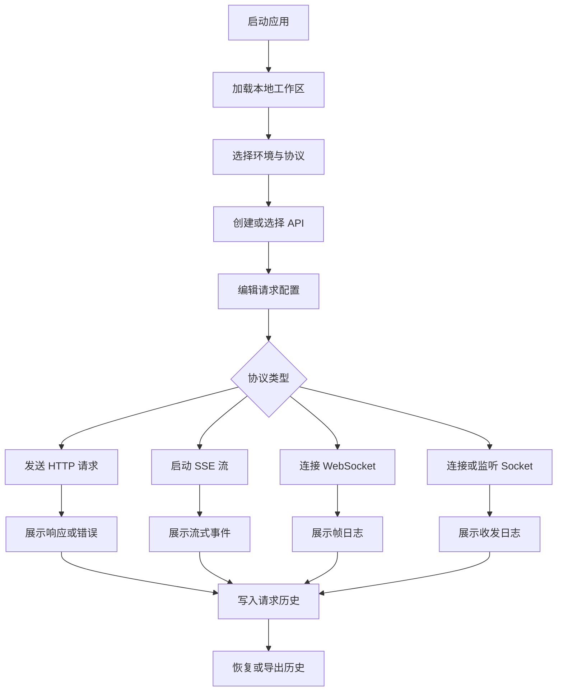

## 1. 产品概述
API-forge 是一款桌面端接口测试与调试工具，面向后端、前端、测试和集成工程师，用于统一管理 API、环境变量、请求调试、长连接测试与历史追踪。
- 主要解决多协议调试工具分散、环境变量难维护、请求历史难复用的问题。
- 产品目标是在 macOS 与 Windows 上提供高密度、低干扰、可持久化的本地调试工作台。

## 2. 核心功能

### 2.1 功能模块
1. **工作区主界面**：API 目录树、协议导航、环境选择、请求标签页、主调试区域。
2. **HTTP 请求调试**：方法、URL、Params、Headers、Body、Auth、响应查看、错误状态和请求历史。
3. **SSE 流式响应调试**：流式请求配置、事件时间线、实时内容、连接状态、统计指标、停止与重连。
4. **WebSocket 测试**：连接管理、消息发送、帧日志、连接统计、心跳与重连配置。
5. **TCP / UDP Socket 测试**：协议切换、连接或监听、文本与 Hex 报文、收发日志、吞吐指标。
6. **环境变量管理**：Dev / Test / Prod 变量、密钥掩码、全局 Headers、变量解析预览、导入导出。
7. **请求历史记录**：历史筛选、分页、详情查看、恢复请求、响应对比入口、导出与清空。
8. **API 目录与导入**：新建目录、新建 API、目录菜单、Postman / OpenAPI 文件或 URL 导入、合并策略。

### 2.2 页面详情
| 页面名称 | 模块名称 | 功能描述 |
| --- | --- | --- |
| 工作区主界面 | 公共布局 | 左侧目录、顶部协议导航、环境选择、请求标签页和主内容区。 |
| HTTP 请求调试 | 请求编辑器 | 支持方法、URL、Params、Headers、Body、Auth 配置和发送请求。 |
| HTTP 请求调试 | 响应查看器 | 展示状态码、耗时、大小、Body、Headers、Cookies、断言和日志摘要。 |
| SSE 流式响应 | 流式会话 | 展示连接状态、事件时间线、实时内容、事件数、平均延迟和持续时间。 |
| WebSocket 测试 | 连接与帧日志 | 支持连接、断开、消息发送、帧过滤、统计和清空日志。 |
| TCP / UDP Socket 测试 | Socket 调试 | 支持 TCP / UDP 配置、发送报文、Hex 预览、模板队列和收发日志。 |
| 环境变量管理 | 变量表格 | 支持变量新增、复制、删除、密钥掩码、筛选、地址预览和全局 Headers。 |
| 请求历史记录 | 历史检索 | 支持按路径、方法、状态、环境、时间筛选，并恢复历史请求。 |
| 请求错误状态 | 错误详情 | 展示错误码、错误体、请求摘要、重试入口和排查建议。 |
| 新建 API 弹窗 | 创建表单 | 创建 HTTP、SSE、WebSocket 或 Socket API 条目。 |
| 新建目录弹窗 | 目录表单 | 创建目录、配置排序、可见性和预览。 |
| API 导入弹窗 | 导入流程 | 支持 Postman / OpenAPI 文件或 URL 导入、解析预览和合并策略。 |

## 3. 核心流程
用户打开应用后进入工作区，选择环境和协议，创建或选择 API，编辑请求配置并发送。请求结果进入响应查看区，同时写入历史。用户可切换到 SSE、WebSocket 或 Socket 页面进行长连接调试，也可在环境变量页面维护变量，在历史页面恢复请求。

## 4. 用户界面设计

### 4.1 设计风格
- 主色：深灰黑工作台背景，辅以蓝绿色状态色、橙色告警色和红色错误色。
- 辅色：代码区使用低饱和蓝灰，表格与面板使用分层边框和轻量阴影。
- 按钮：紧凑型工具按钮为主，主操作按钮使用高对比实心样式，危险操作使用红色描边或轻量填充。
- 字体：界面使用清晰的无衬线字体，代码与请求内容使用等宽字体。
- 布局：桌面优先，高密度多栏工作台，避免营销式卡片堆叠。
- 图标：使用 lucide-react，按钮优先使用图标加工具提示，关键命令可使用图标加文本。

### 4.2 页面设计概览
| 页面名称 | 模块名称 | UI 元素 |
| --- | --- | --- |
| 工作区主界面 | 公共布局 | 固定左栏、顶部协议标签、环境选择器、可关闭请求标签页、深色背景。 |
| HTTP 请求调试 | 请求与响应 | 方法选择器、URL 输入框、发送按钮、标签页编辑区、响应状态条、代码查看器。 |
| SSE 流式响应 | 实时流 | 状态指示、事件时间线、实时文本输出、指标条、停止和重连按钮。 |
| WebSocket 测试 | 帧控制台 | 连接表单、消息编辑器、帧日志表、方向标签、连接统计。 |
| Socket 测试 | 报文控制台 | TCP/UDP 分段控件、主机端口输入、Hex 预览、模板列表、收发日志。 |
| 环境变量管理 | 变量维护 | 环境标签、变量表格、密钥掩码、地址预览、全局 Headers 面板。 |
| 请求历史记录 | 历史列表 | 筛选栏、分页表格、详情抽屉、恢复请求和导出按钮。 |
| 弹窗 | 创建与导入 | 表单字段、解析预览、合并策略单选、确认和取消按钮。 |

### 4.3 响应式
- 以桌面端 Electron 窗口为主，优先适配 1280px 及以上宽度。
- 小宽度窗口下左侧目录可收窄，主区域维持可滚动，不隐藏核心操作。
- 工具栏、表格和代码区需要稳定尺寸，避免发送请求或日志增长导致布局跳动。

### 4.4 非目标
- 首版不实现云同步、团队协作、账号体系和远程服务依赖。
- 首版不强制实现脚本断言执行引擎，可保留 UI 入口和基础摘要展示。
- 首版不做移动端页面，移动适配仅保证窗口缩小时可用。
