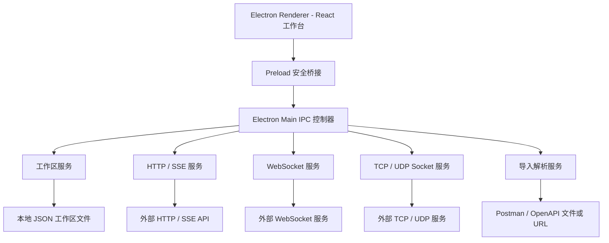
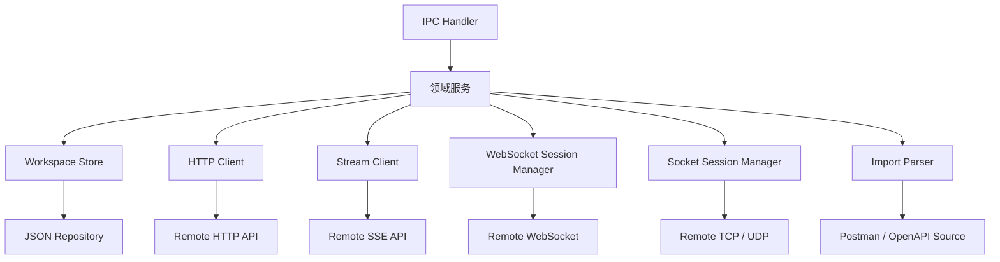
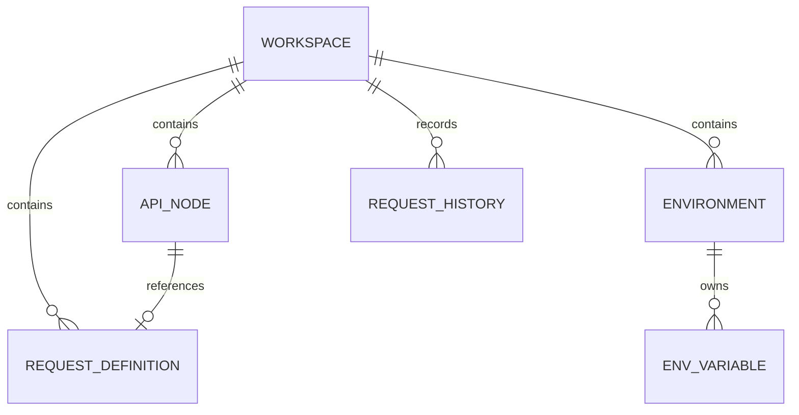

## 1. 架构设计



* Renderer 只负责 UI、状态展示和用户交互。

* Preload 暴露白名单 IPC API，保持 `contextIsolation` 开启、`nodeIntegration` 关闭。

* Main 进程负责文件系统、网络请求、SSE、WebSocket、TCP / UDP、本地持久化和导入解析。

* 首版使用本地 JSON 文件保存工作区数据，后续数据规模增长后可迁移 SQLite。

## 2. 技术说明

* 桌面容器：Electron

* 前端：React\@18 + TypeScript + Vite

* 样式：Tailwind CSS\@3 + CSS 变量主题

* 图标：lucide-react

* 状态管理：Zustand

* 代码编辑：Monaco Editor 或轻量编辑器，首版可按体积与接入复杂度选择

* 构建与打包：electron-builder

* 本地存储：应用数据目录下 JSON 文件，写入时使用临时文件替换保障完整性

* 网络能力：main 进程基于 Node.js API 与 fetch / EventSource 等能力封装

## 3. 路由定义

| 路由              | 用途                     |
| --------------- | ---------------------- |
| `/http`         | HTTP 请求调试主页面。          |
| `/sse`          | SSE 流式响应调试页面。          |
| `/websocket`    | WebSocket 连接与帧日志页面。    |
| `/socket`       | TCP / UDP Socket 测试页面。 |
| `/environments` | 环境变量管理页面。              |
| `/history`      | 请求历史记录页面。              |

应用首屏默认进入 `/http`，公共工作区布局包裹所有页面。

## 4. IPC 定义

### 4.1 工作区与目录

```ts
type Protocol = 'http' | 'sse' | 'websocket' | 'socket'
type HttpMethod = 'GET' | 'POST' | 'PUT' | 'PATCH' | 'DELETE' | 'HEAD' | 'OPTIONS'

interface ApiTreeNode {
  id: string
  type: 'folder' | 'api'
  name: string
  parentId?: string
  method?: HttpMethod
  protocol?: Protocol
  children?: ApiTreeNode[]
}

interface WorkspaceSnapshot {
  apiTree: ApiTreeNode[]
  environments: Environment[]
  requests: RequestDefinition[]
  history: RequestHistoryItem[]
  preferences: UserPreferences
}
```

| IPC                      | 方向               | 说明         |
| ------------------------ | ---------------- | ---------- |
| `workspace:load`         | renderer -> main | 加载完整工作区快照。 |
| `workspace:save`         | renderer -> main | 保存工作区快照。   |
| `api-tree:create-folder` | renderer -> main | 创建目录。      |
| `api-tree:create-api`    | renderer -> main | 创建 API。    |
| `api-tree:update-node`   | renderer -> main | 更新目录或 API。 |
| `api-tree:delete-node`   | renderer -> main | 删除目录或 API。 |

### 4.2 请求调试

```ts
interface HttpRequestInput {
  method: HttpMethod
  url: string
  params: KeyValueItem[]
  headers: KeyValueItem[]
  body?: string
  auth?: AuthConfig
  environmentId: string
}

interface HttpResponseOutput {
  status: number
  statusText: string
  durationMs: number
  sizeBytes: number
  headers: KeyValueItem[]
  body: string
}
```

| IPC            | 方向               | 说明                  |
| -------------- | ---------------- | ------------------- |
| `http:send`    | renderer -> main | 发送 HTTP 请求并返回响应或错误。 |
| `sse:start`    | renderer -> main | 启动 SSE 会话。          |
| `sse:stop`     | renderer -> main | 停止指定 SSE 会话。        |
| `sse:event`    | main -> renderer | 推送 SSE 事件分片。        |
| `sse:complete` | main -> renderer | 推送 SSE 完成事件。        |
| `sse:error`    | main -> renderer | 推送 SSE 错误事件。        |

### 4.3 长连接与 Socket

| IPC                    | 方向               | 说明                |
| ---------------------- | ---------------- | ----------------- |
| `websocket:connect`    | renderer -> main | 建立 WebSocket 连接。  |
| `websocket:send`       | renderer -> main | 发送 WebSocket 消息。  |
| `websocket:disconnect` | renderer -> main | 断开 WebSocket 连接。  |
| `websocket:frame`      | main -> renderer | 推送 WebSocket 帧日志。 |
| `websocket:status`     | main -> renderer | 推送 WebSocket 状态。  |
| `socket:connect`       | renderer -> main | 建立 TCP 连接。        |
| `socket:listen`        | renderer -> main | 启动 UDP 监听。        |
| `socket:send`          | renderer -> main | 发送 TCP / UDP 报文。  |
| `socket:disconnect`    | renderer -> main | 断开或停止监听。          |
| `socket:message`       | main -> renderer | 推送 Socket 收包。     |
| `socket:status`        | main -> renderer | 推送 Socket 状态。     |

### 4.4 导入、环境与历史

| IPC                 | 方向               | 说明                       |
| ------------------- | ---------------- | ------------------------ |
| `import:parse-file` | renderer -> main | 解析 Postman / OpenAPI 文件。 |
| `import:parse-url`  | renderer -> main | 从 URL 拉取并解析 OpenAPI。     |
| `import:apply`      | renderer -> main | 应用导入结果到 API 目录。          |
| `environment:list`  | renderer -> main | 获取环境变量列表。                |
| `environment:save`  | renderer -> main | 保存环境变量。                  |
| `history:list`      | renderer -> main | 查询请求历史。                  |
| `history:create`    | renderer -> main | 写入请求历史。                  |
| `history:clear`     | renderer -> main | 清空请求历史。                  |
| `history:restore`   | renderer -> main | 恢复历史请求快照。                |

## 5. 服务端架构图



## 6. 数据模型

### 6.1 数据模型定义



### 6.2 TypeScript 数据定义

```ts
interface KeyValueItem {
  id: string
  key: string
  value: string
  enabled: boolean
  description?: string
}

interface Environment {
  id: string
  name: string
  variables: EnvironmentVariable[]
  globalHeaders: KeyValueItem[]
}

interface EnvironmentVariable {
  id: string
  key: string
  value: string
  type: 'text' | 'secret'
  scope: 'global' | 'environment'
  description?: string
}

interface RequestDefinition {
  id: string
  protocol: Protocol
  name: string
  method?: HttpMethod
  url: string
  params: KeyValueItem[]
  headers: KeyValueItem[]
  body?: string
  auth?: AuthConfig
  folderId?: string
  updatedAt: string
}

interface RequestHistoryItem {
  id: string
  protocol: Protocol
  method?: string
  url: string
  status?: number
  durationMs?: number
  sizeBytes?: number
  environmentId: string
  createdAt: string
  requestSnapshot: unknown
  responseSnapshot?: unknown
}

interface UserPreferences {
  activeEnvironmentId: string
  activeProtocol: Protocol
  theme: 'dark'
}
```

## 7. 目录结构

```text
src/
  main/
    index.ts
    window.ts
    ipc/
    services/
  preload/
    index.ts
    api.ts
  renderer/
    main.tsx
    App.tsx
    routes/
    layouts/
    pages/
    components/
    stores/
    styles/
  shared/
    types/
    ipc-contracts.ts
    constants.ts
```

## 8. 阶段交付

* 阶段一：Electron + Vite + TypeScript 工程骨架，主窗口可打开，测试 IPC 可调用。

* 阶段二：设计系统与静态页面，所有设计稿对应页面可访问。

* 阶段三：本地数据与工作区状态，目录、标签页、环境变量可持久化。

* 阶段四：HTTP 与 SSE 调试能力可用。

* 阶段五：WebSocket 与 TCP / UDP Socket 调试能力可用。

* 阶段六：API 导入、历史检索、恢复和异常状态完善。

* 阶段七：macOS / Windows 打包与验收。

