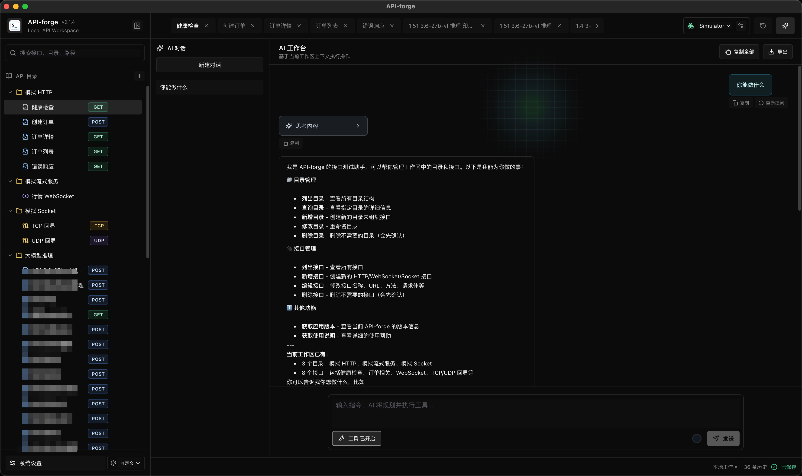
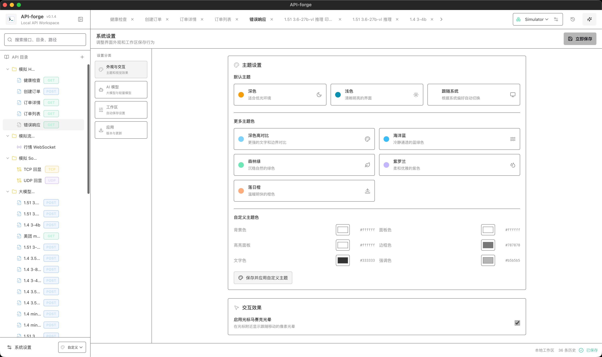

# API-forge

<div align="center">
  
  <p><strong>为接口联调而生的本地桌面工作台</strong></p>
  <p>在一个应用里完成 HTTP、SSE、WebSocket、TCP / UDP 调试，管理环境与请求历史，并让 AI 直接协助整理接口工作区。</p>
  <p>
    <a href="https://github.com/Code4Bug/api-forge/releases"></a>
    <a href="LICENSE"></a>
    
    
  </p>
</div>

## 为什么选择 API-forge

API-forge 将常用的接口调试能力集中在一个轻量、纯本地的桌面应用中。无需登录账号，也不依赖远程项目服务，接口定义、环境变量、请求历史和 AI 对话均保存在本机，适合个人开发、内网联调与多协议服务验证。

- **多协议统一调试**：HTTP、SSE、WebSocket、TCP 和 UDP 无需切换工具
- **围绕工作区组织接口**：目录、标签页、环境和历史记录自然联动
- **变量贯穿请求流程**：支持环境变量，以及从响应 JSONPath 自动提取的流程变量
- **AI 直接操作工作区**：使用 OpenAI 兼容模型查询、创建和修改接口与目录
- **桌面端原生网络能力**：HTTP、SSE、TCP / UDP 请求由 Electron 主进程执行
- **本地优先**：工作区与对话数据留在本机，适合内网和隐私敏感场景

## 应用预览

| 暗色主题 | 亮色主题 |
| --- | --- |
|  |  |

## 核心能力

### HTTP 与 SSE

- 支持 `GET`、`POST`、`PUT`、`PATCH`、`DELETE`、`HEAD`、`OPTIONS`
- 编辑 Params、Headers、Bearer Token 和请求体
- 支持 JSON、表单、multipart 与文本内容，JSON 可格式化或压缩
- 展示状态码、响应头、响应体、耗时、大小与基础日志
- 自动识别 `text/event-stream`，实时展示 SSE 流式响应并支持中断
- 支持基于 `status`、`headers`、`body` 的 JavaScript 响应断言

### WebSocket 与 Socket

- WebSocket 连接、断开、文本消息发送与帧日志
- TCP / UDP 连接和实时收发日志
- 支持 UTF-8 与 Hex 报文
- 地址和报文均可使用环境变量

### 工作区与变量

- 目录和 API 的新建、重命名、删除、搜索与拖拽移动
- 多请求标签页、自动保存和启动恢复
- 从常见 cURL 命令快速创建 HTTP API
- 将接口复制为 cURL，或将目录导出为 Markdown / HTML API 文档
- 多环境切换、变量管理、密钥掩码和 JSON 导入导出
- 使用 JSONPath 从上游响应提取流程变量，供后续请求引用

### 历史与 AI

- 持久化 HTTP 请求历史，支持关键词、方法、状态和环境筛选
- 查看请求与响应快照，并从历史记录恢复请求
- 配置多个 OpenAI 兼容的大模型与轻量模型
- AI 流式对话、思考内容展示、上下文占用提示和本地会话保存
- AI 可查询、新增、编辑和删除工作区目录及接口，危险操作需要确认
- 支持复制消息、重新提问以及导出完整对话

### 外观与桌面体验

- 深色、浅色、跟随系统和多套预设主题
- 自定义配色、随机配色及主题保存复用
- 可配置光标马赛克光晕效果
- 记忆窗口位置与尺寸
- 正式版本支持应用内检查、下载和安装更新

## 快速开始

### 环境要求

- Node.js 18+
- pnpm

### 启动桌面端

```bash
pnpm install
pnpm dev
```

开发服务默认运行在 `http://localhost:5174`。也可以执行 `pnpm dev:web` 仅预览界面，但真实 HTTP、SSE、TCP / UDP 能力需要在 Electron 桌面端中使用。

### 启动本地模拟服务

仓库内置了一个无需额外生产依赖的多协议模拟服务，方便快速体验完整链路：

```bash
cd api-server-simulator
pnpm start
```

| 协议 | 默认地址 |
| --- | --- |
| HTTP | `http://127.0.0.1:8787` |
| SSE | `http://127.0.0.1:8787/sse/events` |
| WebSocket | `ws://127.0.0.1:8787/ws/market` |
| TCP | `127.0.0.1:18080` |
| UDP | `127.0.0.1:18081` |

模拟服务启动时会初始化可直接使用的 `~/.api-forge/workspace.json`。更多接口和配置方式见 [模拟服务说明](api-server-simulator/README.md)。

## 常用命令

| 命令 | 说明 |
| --- | --- |
| `pnpm dev` | 启动 Electron 开发环境 |
| `pnpm dev:web` | 仅启动浏览器界面预览 |
| `pnpm test` | 执行 TypeScript 类型检查 |
| `pnpm lint` | 执行 ESLint 检查 |
| `pnpm build` | 构建应用 |
| `pnpm build:mac` | 构建 macOS 安装包 |
| `pnpm build:win` | 构建 Windows x64 / arm64 安装包 |
| `pnpm build:win:x64` | 构建 Windows x64 安装包 |
| `pnpm build:win:arm64` | 构建 Windows arm64 安装包 |
| `pnpm build:linux` | 构建 Linux x64 / arm64 的 AppImage 与 deb |
| `pnpm build:linux:x64` | 构建 Linux x64 的 AppImage 与 deb |
| `pnpm build:linux:arm64` | 构建 Linux arm64 的 AppImage 与 deb |

构建产物输出到 `release/`。macOS 跨平台构建 Windows 安装包需要 Wine；正式分发前还需要自行配置对应平台的代码签名。

### Linux 安装

- `*.AppImage`：下载后先赋予可执行权限，再直接双击或运行。
  ```bash
  chmod +x API-forge-*.AppImage
  ./API-forge-*.AppImage
  ```
- `*.deb`：使用系统包管理器安装。
  ```bash
  sudo apt install ./API-forge-*.deb
  ```
- 安装后在应用启动器里搜索 `API-forge`。
- 如果一时没显示，先注销重登或刷新桌面菜单缓存；有些桌面环境会把新程序放在“实用工具”分类下。

## 技术架构

```text
React 18 + TypeScript + Vite
            │
     Electron preload
      白名单 IPC API
            │
      Electron 主进程
  网络请求 / Socket / 本地存储
```

- React Router 管理页面与协议路由
- Zustand 管理工作区、环境、请求与用户偏好
- Monaco Editor 提供 JSON 和文本编辑体验
- Tailwind CSS 与自定义主题变量构建界面
- Electron 启用 `contextIsolation`，关闭 `nodeIntegration`
- 工作区写入采用临时文件加重命名，减少文件损坏风险

## 数据存储

| 数据 | 默认位置 |
| --- | --- |
| 工作区 | `~/.api-forge/workspace.json` |
| 请求历史 | `~/.api-forge/history.json` |
| AI 对话 | `~/.api-forge/conversations/` |
| 运行日志 | `~/.api-forge/logs/` |

> [!WARNING]
> 密钥变量和 AI API Key 目前会写入本地配置文件，界面掩码不等于加密存储。请勿在共享设备上保存生产凭据。

## 项目结构

```text
src/                    React 页面、组件、状态与共享类型
electron/main/          桌面窗口、网络能力与本地存储
electron/preload/       渲染进程可访问的安全 IPC 白名单
api-server-simulator/   HTTP / SSE / WebSocket / TCP / UDP 模拟服务
design/pages/           产品设计稿
snapshots/              应用截图
```

## 当前边界

API-forge 仍在快速迭代中。Postman / OpenAPI 导入、WebSocket 重连与二进制消息、历史响应对比、Cookie 解析和系统钥匙串存储等能力尚未完成。详细进度见 [todo-list.md](todo-list.md)。

## 发布

推送以 `v` 开头的版本标签后，GitHub Actions 会构建 macOS、Windows 和 Linux 安装包并创建 Release：

```bash
git tag v0.2.0
git push origin v0.2.0
```

## License

本项目基于 [Apache License 2.0](LICENSE) 开源。
